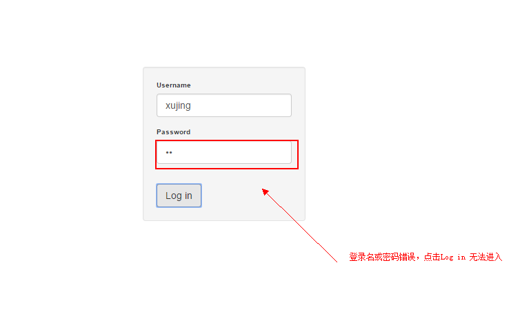
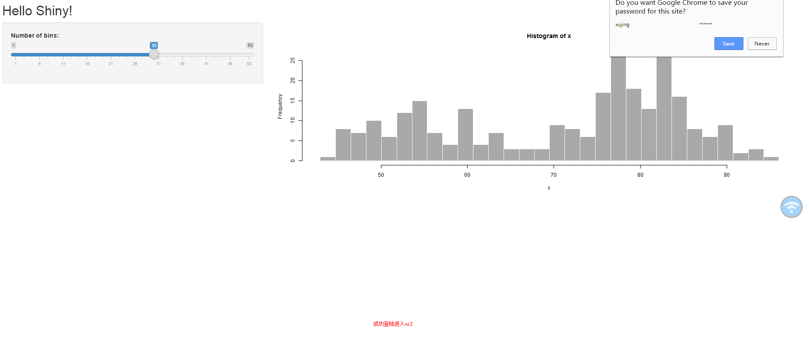

# Shiny with Login Privileges

  **by  XuJing**  

 (Inter-Credit Technology  Co., Ltd. Algorithm Engineer) 

Table of Contents
----

  *  Shiny with Login Privileges
   
  *  Content

  *  how part login interface

  *  Apply
  
----

## Content

基于第十届R语言会议（北京）中谢佳标老师的报告，fork了佳标老师的核心代码，实现
shiny的权限登录设置的功能。代码需要了解shiny,shinyjs,及CSS的基本语法。并且我们
在尝试把其应用到其他复杂的UI跳转中。

## Show part login interface 

关于详细的实现方式可参见本项目代码。

权限设置不正确：无法跳转到ui2

正确登录，跳转至ui2

## Apply

在公司服务器部署shiny server 或在linux系统的PC上部署[shiny server](https://github.com/DataXujing/Install-R-rstudio-server-shiny-server-git)
作为数据分析师或产品经理，你可以把自己的分析报告或需求分析通过权限设置指定给
你愿意的角色阅读，安全方便。

